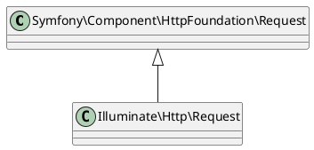

---

theme: "Night"
transition: "default"
progress: true
slideNumber: true
loop: true
backgroundTransition: 'zoom'


---

# 4章

## HTTPリクエストとレスポンス

---

## はじめに

- 本資料は、Weeyble Laravel 輪読会用の資料です
- 対応箇所は、4章の前半部分のみです
- 権利関係で問題がございましたら、ご指摘ください
- このスライドは reveal.js で閲覧することを前提に作成しています
  - 参考：[非エンジニアのためのお手軽reveal.js入門](https://jyun76.github.io/revealjs-vscode/)

--

## 発表者自己紹介

- 今村昌平と申します。
- Web業務システム受託の会社で勤務(1年半)
- 自分で Webアプリ作成中(マニュアル共有アプリ)
- Web業界入る前は、動物のお医者さん

--

## 本日の概要

### 前半

- リクエストハンドリング
- バリデーション

### 後半

- レスポンス
- ミドルウェア

---

## 4-1 リクエストハンドリング

- HTTP リクエストは、プログラム上で `Request` インスタンスとして取得・使用できる
- リクエストの利用方法は主に３種類ある

---

### 4-1-1 リクエストの取得

- Illuminate\Http\Request クラスのインスタンスとして取得する
  - `public/index.php` 内

--

### クラス


--

### リクエストの取得方法

1. ファサードを利用する
    - Input ファサード
    - Request ファサード
2. DI を利用する
    - コンストラクタインジェクション
    - メソッドインジェクション
3. フォームリクエストを利用する

---

### 4-1-2 Inputファサード・Requestファサード

- Inputファサードと Requestファサードはほとんど同じ使い方
- Input::get メソッドのみ異なる

--

### Input ファサード

```php
// name キーでリクエストから値を取得する
$name = Input::get('name');

// name キーがない場合「guest」を返す
$name = Input::get('name', 'guest');
```

--

### Inputファサードの実装

- Illuminate\Support\Facades\Input に実装されている

---

### 4-1-3 Requestオブジェクト

---

### 4-1-4 フォームリクエスト

---

## 4-2 バリデーション

---

### 4-2-1 バリデーションルールの指定方法

---

### 4-2-2 バリデーションルール

---

### 4-2-3 バリデーションの利用

---

### 4-2-4 バリデーション失敗時の処理

---

### 4-2-5 ルールのカスタマイズ

---

## リファレンス

[日本語リファレンス Laravel 5.5 ファサード](https://readouble.com/laravel/5.5/ja/facades.html)
>ファサードの一番の危険性は、クラスの責任範囲の暴走です。ファサードはとても簡単に使用でき、依存注入も必要ないため、簡単にクラスが成長し続ける結果、一つのクラスで多くのファサードが使われます。依存注入を使用すれば、クラスが大きくなりすぎることに伴う、大きなコンストラクタの視覚的なフィードバックにより、この危険性は抑制されます。ですから、ファサードを使用するときは、クラスの責任範囲を小さくとどめるため、クラスサイズに特に注意をはらいましょう。

---

## Appendix

[README.md](https://github.com/ShoheiImamura/laravel-chapter2#appendix)

--

## 2章 前半の用語集

| No. | 日本語名         | 英語名               | 説明                                                                                 |
|-----|------------------|----------------------|--------------------------------------------------------------------------------------|
| 1   | エントリポイント | entry point          | コンピュータプログラムを構成するコードのうち、最初に実行する事になっている位置のこと |
| 2   | HTTPリクエスト   | HTTP request         | Web ブラウザからからサーバに送信されるデータ送信要求                                 |
| 3   | HTTPレスポンス   | HTTP response        | サーバが、HTTPリクエストに対して応答するデータ                                       |
| 4   | オートローダ     | autoloader           | クラスやインターフェイス、トレイトが定義されたPHPファイルを自動で読み込む仕組み      |
| 5   | サービスコンテナ | Service Container    | クラス間の依存を管理する強力な管理ツール                                             |
| 6   | バインド         | bind                 | サービスコンテナに対して、インスタンスの生成方法を登録する処理                       |
| 7   | 解決             | resolve              | 指定されたインスタンスをサービスコンテナが生成して返すこと                           |
| 8   | 依存性の解決     | Dependency Injection | クラスやメソッド内で利用する機能を外部から渡す設計パターン                           |

--

## Laradock による環境構築

### 任意のリポジトリで実施します

```shell
# 本資料 Github リポジトリを git clone します
git clone https://github.com/ShoheiImamura/laravel-chapter2.git

# laradock に移動します
cd laravel-chapter2/laradock

# .env ファイルを作成します
cp env-example .env

# docker を立ち上げます
docker-compose up -d nginx mysql

# docker コンテナの中に入ります
docker-compose exec workspace bash
```

### 以下 Docker コンテナ内での作業です

```shell
# composer をインストールします
composer install

# .env ファイルを作成します
cp .env.example .env

# Laravel の api key を作成します
php artisan key:generate
```

上記で環境構築完了です。  
http://localhost にアクセスすると、Laravel の HOME 画面が表示されます。  

Docker コンテナ内の `/var/www/` とローカルフォルダの `/sampleapp` がマウントされていますので、  
sampleapp 以下のファイルを更新すると、Docker 内のファイルも更新されます。

