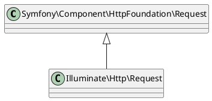

---

theme: "Night"
transition: "default"
progress: true
slideNumber: true
loop: true
backgroundTransition: 'zoom'


---

# 4章

## HTTPリクエストとレスポンス

---

## はじめに

- 本資料は、Weeyble Laravel 輪読会用の資料です
- 対応箇所は、4章の前半部分のみです
- 権利関係で問題がございましたら、ご指摘ください
- このスライドは reveal.js で閲覧することを前提に作成しています
  - 参考：[非エンジニアのためのお手軽reveal.js入門](https://jyun76.github.io/revealjs-vscode/)

--

## 発表者自己紹介

- 今村昌平と申します。
- Web業務システム受託の会社で勤務(1年半)
- 自分で Webアプリ作成中(マニュアル共有アプリ)
- Web業界入る前は、動物のお医者さん

--

## 本日の概要

### 前半

- リクエストハンドリング
- バリデーション

### 後半

- レスポンス
- ミドルウェア

---

## 4-1 リクエストハンドリング

- HTTP リクエストは、プログラム上で `Request` インスタンスとして取得・使用できる
- リクエストの利用方法は主に３種類ある

---

### 4-1-1 リクエストの取得

- Illuminate\Http\Request クラスのインスタンスとして取得する
  - `public/index.php` 内

--

### クラス


--

### リクエストの取得方法

1. ファサードを利用する
    - Input ファサード
    - Request ファサード
2. DI を利用する
    - コンストラクタインジェクション
    - メソッドインジェクション
3. フォームリクエストを利用する

---

### 4-1-2 Inputファサード・Requestファサード

- Inputファサードと Requestファサードはほとんど同じ使い方
- Input::get メソッドのみ異なる

--

### Input ファサード

```php
// name キーでリクエストから値を取得する
$name = Input::get('name');

// name キーがない場合「guest」を返す
$name = Input::get('name', 'guest');
```

--

### Inputファサードの実装

- サービスコンテナでは、文字列`request`と`Illuminate\Http\Request`クラスをバインドしている
- getFacadeAccessor メソッド内で文字列`request`をサービスコンテナに渡す
  - `Illuminate\Support\Facades\Input`内に実装

--

### Requestファサードの実装

- Inputファサードと同様に文字列`request`をサービスコンテナにわたす

--

### リクエスト値を連想配列に保存する

- `all()`メソッドを利用すると、すべての入力値を連想配列として保存できる

```php
// すべての入力値を$inputsで取得（Inputファサード）
$input = Input::all();

// すべての入力値を$inputsで取得（Requestファサード）
$input = Request::all();
```

--

### 指定した入力項目のみ取得する

- `only()`メソッドを利用すると、指定した入力値のみを配列で取得する

```php
// 配列で指定した入力値のみ取得し、値を取り出す（Inputファサード）
$inputs = Input::only(['name', 'age']);
$name = $inputs['name'];

// 配列で指定した入力値のみ取得し、値を取り出す（Requestファサード）
$inputs = Request::only(['name', 'age']);
$name = $inputs['name'];
```

--

### アップロードされたファイルを取得する

- `file()`メソッドを使用すると、アップロードしたファイルを取得できる

```php
// アップロードされたファイルを取得し、$contentに読み込む
$file = Input::file('material');
$content = file_get_contens($file->getRealPath());

// アップロードされたファイルを取得し、$contentに読み込む
$file = Request::file('material');
$content = file_get_contens($file->getRealPath());
```

--

### メソッドまとめ

| メソッド | 説明                               | ファサード     |
|----------|------------------------------------|----------------|
| cookie   | クッキーの値を取得                 | Input, Request |
| header   | ヘッダ値を取得                     | Input, Request |
| server   | 全サーバ値を取得                   | Input, Request |
| get      | Requetから値を取得する             | Input          |
| all      | Requetから全ての値を取得する       | Input, Request |
| only     | 指定した入力項目のみ取得する       | Input, Request |
| file     | アップロードしたファイルを取得する | Input, Request |

---

### 4-1-3 Requestオブジェクト

- サービスコンテナ機能を用いて `Illuminate\Http\Request`クラスのインスタンスを直接使用できる
  - コンストラクタインジェクション
  - メソッドインジェクション

--

### メソッドインジェクションの例

```php
class UserController extends Controller
{
    // 引数でRequestクラスのインスタンスを渡す
    public function register(Request $request)
    {
        // インスタンスに対して値を問い合わせ
        $name = $request->input('name');
        $age = $request->input('age');
        // （略）
    }
}
```

--

### json リクエストを扱う

- json リクエストを扱うこともできる

--

### jsonリクエストを取得する

- `json()`メソッドで値を取得することができる

```php
final class PayloadAction
{
    public function __invoke(Request $request)
    {
        $result = $request->json('nested');
    }
}
```

---

### 4-1-4 フォームリクエスト

- `Illuminate\Http\Request`を継承したクラスを作成できる
- バリデーションルールや、認証機能を定義できる
  - コントローラクラスから、バリデーションロジックを分離できる

--

### フォームリクエストを使って入力値を取得する例

```php
// Illuminate\Http\Request を継承するクラス
use App\Http\Requests\UserRegisterPost;

class UserController extends Controller
{
    // 引数でUserRegisterPostクラスのインスタンスを渡す
    public function register(UserRegisterPost $request)
    {
        // インスタンスに対して値を問い合わせ
        $name = $request->input('name');
        $age = $request->input('age');
    }
}

```

--

### フォームリクエストを作成する例

- 下記コマンドを実行すると、`UserRegistPost`クラスが作成される

```shell
$ php artisan make:request UserRegistPost

 app
 |--Http
    |--Controllers
    |--Middleware
    |--Requests
        |--UserRegistPost
```

--

### フォームリクエストクラス

- `authorize`メソッドと`rule`メソッドが用意
  - メソッドインジェクションを利用可能

| メソッド    | 機能                         |
|-------------|------------------------------|
| authorize() | リクエストに対する権限を設定 |
| rule()      | バリデーションルールを設定   |

--

### フォームリクエストクラスのコード例

```php
namespace App\Http\Requests;
use Illuminate\Foundation\Http\FormRequest;

class UserRegistPost extends FormRequest
{
    public function authorize() // リクエストに対する権限
    {
        return false;
    }
    public function rules() // バリデーションルール
    {
        return [];
    }
}
```

---

## 4-2 バリデーション

- 利用者から送信されたデータを検証する仕組み
  - 不適切なデータ入力の除外
  - 脆弱性を狙った攻撃からの防御

--

### バリデーションの利用方法

- バリデーションの実装方法は、様々用意されている
    1. コントローラの `validate` メソッドを利用
    2. `validator` クラスのインスタンスを生成
    3. フォームリクエストを利用

---

### 4-2-1 バリデーションルールの指定方法

- ルールを定義する必要がある
- ルール定義は `入力項目のキー名`と`バリデーションルール` を連想配列で指定
- 1つの`キー名`に対して、複数の`ルール`を指定可能
    1. 配列で指定
    2. パイプラインで区切る（本書では非推奨）

--

### バリデーションのルール定義例

```php
[
    // title は、入力必須、postsテーブル内で一意、最長255文字
    'title'   => ['required', 'unique:posts', 'max:255'],

    // body は、入力必須
    'body'    => ['required'],

    // publish は、Nullもしくは有効な日付
    'publish' => ['nullable', 'date']
]
```

---

### 4-2-2 バリデーションルール

- デフォルトで、様々な種類のバリデーションルールが用意されている
    1. 値の存在確認を行うルール
    2. 型やフォーマット確認を行うルール
    3. 桁数や文字列、サイズ確認をおkの合うルール
    4. 他の対象との比較を行うルール
    5. バリデーション処理に対するルール

--

### 値の存在を確認するルール

```php
$rule = [
    'name' => 'required', // 必須項目
];
```

--

### 型やフォーマットを確認するルール

```php
$rules = [
    'user_no'    => 'numeric', // 数値
    'alpha'      => 'alpha',   // 全て英字
    'email'      => 'email',   // メールアドレス形式
    'ip_address' => 'ip',      // ipアドレス形式
];
```

--

### 桁数や文字数、サイズを確認するルール

```php
$rule = [
    'bank_pass'    => 'digits:4',            // 4桁の数値
    'signal_color' => 'in:green,red,yellow', // 3種のうちのいずれか
];
```

--

### 組合せによって確認方法が変化するルール

```php
$rule = [
    'number' => ['integer', 'size:10'],// 数値が10
    'name'   => 'size:10',             // 10文字
    'button' => ['array', 'size:10'],  // 要素数が10
    'upload' => ['file', 'size:10'],   // ファイルサイズ10KB
]
```

--

### 正規表現によるルール

```php
$rule = [
    'user_id' => 'regix:/^[0-9a-zA-Z]+$/', // 半角英数字
];
```

--

### ほかの対象と比較するルール

```php
$rule = [
    // emailとemail_confirmationが同値
    'email' => 'confirmed',
];
```

--

### unique ルールの指定

```php
$rule = [
    // users テーブルの同名カラムと比較して重複しない
    'name' => 'unique:users',

    // users テーブルのemailカラムと、mailフィールドの値を比較して重複
    'mail' => 'unique:users,email',

    // 上記と同じルール、ただし id が100 のレコードは重複許可
    'mail' => 'unique:users,email,100'
];
```

--

### バリデーション処理に対するルール

```php
$rule = [
    // email フィールドでエラーとなった場合は、
    // 続くnameに対する処理は実行されない
    'email' => ['bail', 'required', 'unique:posts', 'email'],
    'name'  => ['required', 'max:255']
];
```

---

### 4-2-3 バリデーションの利用

- コントローラでのバリデーション
- フォームリクエストを使ったバリデーション

--

### コントローラでのバリデーション

1. validate メソッドを利用する
    - 第一引数：request インスタンス
    - 第荷引数：バリデーションルール
2. validator クラスを利用する
    - makeメソッドでインスタンス生成

--

### validate メソッドの例

```php
public function register(Request $request)
{
    // ルールを定義
    $rules = [
        'name'  => ['required', 'max:255'],
        'email' => ['required', 'email', 'max:255']
    ];

    // バリデーション実行
    $this->validate($request, $rule);

    // バリデーション通過後の処理（略）
    ...
}
```

--

### validator クラスを使ったバリデーション処理例

```php
public function register(Request $request)
{
    // ルールを定義（略）
    $rules = [];

    // 全ての入力値を $input に保持
    $input = $request->all();

    // バリデータのインスタンスを生成
    $validator = Validator::make($input, $rules);

    // バリデーションエラー時の処理を記述
    if ($validator->fail()){
        // 処理
    };

    // バリデーション通過後の処理（略）
}
```

--

### フォームリクエストによるバリデーション

- フォームリクエストクラスで、バリデーションルールを定義する
- コントローラでは、フォームリクエストを呼び出す

--

### フォームリクエストによるルール定義例

```php
class UserRegistPost extends FormRequest
{
    // フォーム処理への権限がある場合は true
    public function authorize()
    {
        return true;
    }
    // バリデーションルールを return する
    public function rules()
    {
        return [
            'name'  => ['required', 'max:255'],
            'email' => ['required', 'email', 'max:255'],
        ];
    }
}
```

--

### フォームリクエストを利用しているコントローラ

```php
class UserController extends Controller
{
    public function register(UserRegistPost $request)
    {
        // バリデーション判定済み

        // バリデーション通過後の処理
        $name = $request->input
        ...
    }
}
```

---

### 4-2-4 バリデーション失敗時の処理

- バリデーションチェックの結果は「MessageBag」オブジェクトで保持
  - Illuminate\Suppport\MessageBag
- MessageBag インスタンスは $errors の名前でビュー中に用意されている

--

### ビューの表示例

```html
<body>
    <h1>ユーザ登録フォーム</h1>
    <ul>
    @if (count($errors)>0)
        @foreach($errors->all() as $error)
        <li>{{$error}}</li>
        @endoforeach
    @endif
    </ul>
</body>
```

--

### エラーメッセージの表記

- デフォルトではエラーメッセージは英語表記

--

### フォームリクエストにメッセージを指定する例

```php
class UserRegistPost extends FormRequest
{
    public function authorize(){
        return true;
    }

    public function messages(){
        return [
            'name.required' => '名前は必ず入力してください',
            'name.max' => '名前は最大20文字まで入力できます',
            'email.required' => 'メールアドレスは必ず入力してください',
            'email.email' => 'メールアドレスの形式は正しくありません',
            'email.max' => 'メールアドレスは最大255文字まで入力できます'
        ];
    }
}
```

---

### 4-2-5 ルールのカスタマイズ

- Laravel のデフォルトで規定されていないルールを追加できる機能
  - extend メソッド
  - sometimes メソッド

--

### extend メソッドを使用したルールの追加

- Validator クラスの extend メソッドを利用する
  - 第一引数：ルール名
  - 第二引数：クロージャ
- クロージャからの戻り値が true の場合、ルールに適合

--

### extend メソッドを使用したルールの追加例

```php
// ルール 'ascii_alpha' を指定
$rules = [
    'name' => ['required', 'max:20', 'ascii_alpha'],
    'email' => ['required', 'email', 'max:255'],
];
// バリデーションルールに 'ascii_alpha' を追加
Validator::extend('ascii_alpha', function($attribute, $value, $parameters){
    return preg_match('/^[a-zA-Z]+$/', $value);
});
```

--

### 条件によるルールの追加

- Validatorクラスの sometimes メソッドを利用する
  - 第一引数：入力項目
  - 第二引数：適用ルール
  - 第三引数：ルール適用条件クロージャ（戻り値 true の場合に適用）

--

### 条件によるルールの追加例

```php
$rules = [
    'name' => ['required', 'max:20'],
    'email' => ['required', 'email', 'max:255']
];
$inputs = $request->all();
$validator = Validator::make($inputs, $rules);
// メルマガを受け取る場合、年齢が18以上であること
$validator->sometimes('age', 'integer|min:18',
function($inputs){
    return $input->mailmagezine == 'allow';
});
```
